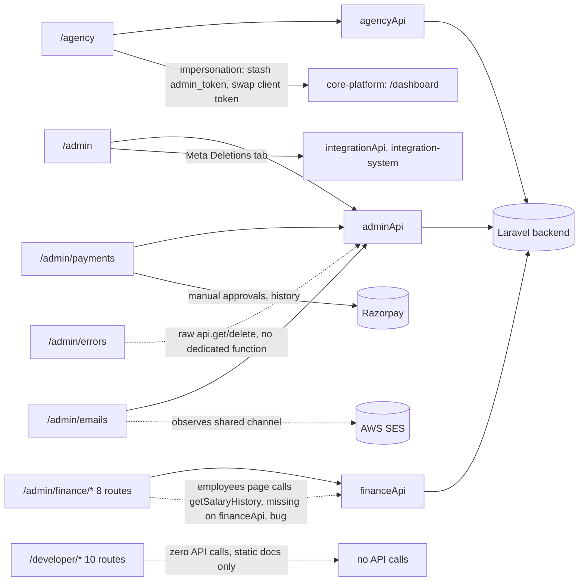

# Context Pack: Admin System

## Purpose
Everything that manages the platform itself rather than a single tenant's CRM data: agencies managing their sub-client companies, the Super Admin governance console (companies/users/billing/plans/health/impersonation), platform-wide email and error monitoring, an internal (non-tenant-facing) finance/P&L suite, and a static developer-documentation hub. Grouped together because all six are either Super-Admin-only or governance-adjacent, and several share the impersonation/`admin_token` mechanic and the `adminApi`/`agencyApi`/`financeApi` API surfaces.

## Features included
| Feature | Status | Plan key | Doc |
|---|---|---|---|
| Agency Client Management | active | `agency_management` | [../features/agency_management.md](../features/agency_management.md) |
| Super Admin Platform Control | active | `system_admin` | [../features/system_admin.md](../features/system_admin.md) |
| Email Infrastructure Monitoring | active | `email_logs` | [../features/email_logs.md](../features/email_logs.md) |
| Application Error Monitoring | active | `error_logs` | [../features/error_logs.md](../features/error_logs.md) |
| Finance Module (Internal P&L, Revenue, Payroll) | active | `finance_module` | [../features/finance_module.md](../features/finance_module.md) |
| Developer Hub (Meta API Documentation Suite) | placeholder | `developer_tools` | [../features/developer_tools.md](../features/developer_tools.md) |

## Pages included
- `/agency` — [../pages/agency.md](../pages/agency.md)
- `/admin`, `/admin/payments` — [../pages/admin-dashboard.md](../pages/admin-dashboard.md), [admin-payments.md](../pages/admin-payments.md)
- `/admin/emails` — [../pages/admin-emails.md](../pages/admin-emails.md)
- `/admin/errors` — [../pages/admin-errors.md](../pages/admin-errors.md)
- `/admin/finance/*` (8 sub-routes: dashboard, revenue, expenses, employees, payroll, churn, reports, plans) — [../pages/admin-finance.md](../pages/admin-finance.md)
- `/developer/*` (10 sub-routes) — [../pages/developer-hub.md](../pages/developer-hub.md)

## APIs involved
- [api/agency.md](../api/agency.md) — `agencyApi` (`src/lib/api.ts` ~line 1949): client onboarding, subscription renewal/deletion, subscription-history, impersonation login-as.
- [api/admin.md](../api/admin.md) — `adminApi` (~line 1642, the largest of these groups): companies/users CRUD, plan/capability JSON editing (`AVAILABLE_PLATFORM_FEATURES`), health metrics, Meta deletion requests (via `integrationApi.getDeletionRequests()`, cross-system), announcements, tester requests, `getEmailStats`/`toggleCompanyEmail`/`toggleUserNotification`, coupons/settings for `/admin/payments`.
- [api/finance.md](../api/finance.md) — `financeApi` (~line 2031): revenue/expense/payroll ledgers, P&L, churn, plan pricing history (distinct from `adminApi`'s plan *capability* editing — see Known issues).
- **`/admin/errors`** uses the raw `api` client directly (`api.get('/errors')`, `api.delete('/errors/clear')`) — no dedicated named function.
- Cross-system: `integrationApi.getDeletionRequests()` for the Meta Deletions tab in `/admin`.

## State contexts involved
None owned here. Reads `useUser()` for `hasFeature`/`hasType(['super_admin'])` gating; Super Admin always passes `hasFeature` regardless of plan.

## External integrations
- **Laravel backend** — all governance/monitoring/finance data.
- **AWS SES** — the shared transactional-email channel monitored by Email Infrastructure Monitoring (not configured here, only observed).
- **Razorpay** — manual payment approval/history on `/admin/payments` (the admin-facing counterpart to [core-platform-system.md](core-platform-system.md)'s tenant-facing checkout).

## Business flows
- [../flows/agency-client-management.md](../flows/agency-client-management.md)
- [../flows/finance-operations.md](../flows/finance-operations.md)
- [../flows/super-admin-governance.md](../flows/super-admin-governance.md) — covers `system_admin`, `email_logs`, and `error_logs` together.

## Dependencies on other systems
- **→ [core-platform-system.md](core-platform-system.md)**: the impersonation mechanic (`admin_token` in `localStorage`) is shared with Super Admin's own impersonation flow there; agency impersonation lands on the client's `/dashboard`.
- **→ [integration-system.md](integration-system.md)**: `/admin`'s Meta Deletions tab reads `integrationApi.getDeletionRequests()`.
- No other system depends on this one — it's a leaf/observer system except for the impersonation mechanic it shares with core-platform.

## Mermaid architecture diagram

## Known issues
1. **`financeApi.getSalaryHistory` doesn't exist** — `admin/finance/employees/page.tsx` calls it, but only `getEmployeeSalaryHistory` is exported. Likely a runtime error on that specific action.
2. **Inconsistent client-side guards across this system**: `/admin`, `/admin/payments`, `/admin/errors` use `RoleGuard`; `/admin/emails`, the entire `/admin/finance/*` tree, and 9 of 10 `/developer/*` pages have **no client-side `RoleGuard` at all** — access relies solely on the sidebar hiding the link plus backend enforcement. A direct URL visit by an authenticated-but-unauthorized user will render the page shell client-side (API calls would then 401).
3. **Developer Hub makes zero API calls anywhere** — confirmed via directory-wide search. It's static reference/marketing content, not a functional tool; treat `status: placeholder` as literal.
4. **Two separate "Plans" concepts easily confused**: `/admin`'s Plans tab (`adminApi.getPlans/createPlan/updatePlan`) edits the actual feature/capability JSON that drives plan gating platform-wide; `/admin/finance/plans` (`financeApi.getPlans/updatePlanPricing`) only tracks **pricing history** for accounting purposes. Don't conflate them when asked to "edit a plan."
5. **`/admin` "Demo Data" toggle** switches the entire page to local mock data without hitting the API — not a real data mode, useful only for screenshots.
6. **Currency formatting (`fmt()`, `Intl.NumberFormat('en-IN', ...)`) is duplicated per-file** across all 8 finance sub-pages rather than shared — a good extraction candidate if touching more than one of them.
7. **CSV/report exports throughout this system are client-side only** (Finance's Reports page, Error Logs has no export) — no server-side export endpoint is involved anywhere in this pack.

## Common implementation patterns
- **Plan/capability editing** always goes through `adminApi`'s "Smart JSON" `features` column shape: `{ display: [...toggles], permissions: { featureId: [allowedRoles] } }` — `AVAILABLE_PLATFORM_FEATURES` in `/admin/page.tsx` enumerates every plan-gatable feature id in the app (including every feature documented across all seven context packs) — check this list before assuming a new feature key needs separate wiring.
- **Impersonation** always uses the `admin_token`/`token` localStorage swap pattern (stash current token as `admin_token`, set `token` to the target user's, hard-navigate) — replicate this exact pattern rather than inventing a new impersonation mechanism if extending it.
- **Page-colocated component folders** (e.g. `src/app/(dashboard)/admin/payments/components/CouponsTab.tsx`) are used instead of `src/components/*` for admin-only sub-components — consistent with how this system tends not to share components with the rest of the app.

## Files to load before modifying this system
1. `src/app/(dashboard)/admin/page.tsx` — large (~3260 lines), read only the relevant tab section rather than the whole file.
2. `src/lib/api.ts` — `adminApi`, `agencyApi`, `financeApi` sections only.
3. `src/app/(dashboard)/admin/finance/layout.tsx` if touching any finance sub-route (shared nav shell).
4. `src/components/RoleGuard.tsx` — check before assuming a given admin page has (or should have) client-side gating; several don't, per Known issues.
5. This pack's linked feature/api/flow docs above.

## Manual Notes
_None yet. Add notes here for anything this pack should account for that isn't derivable from the generated docs — this section is preserved verbatim across regenerations (see [../ai-rules.md](../ai-rules.md))._
