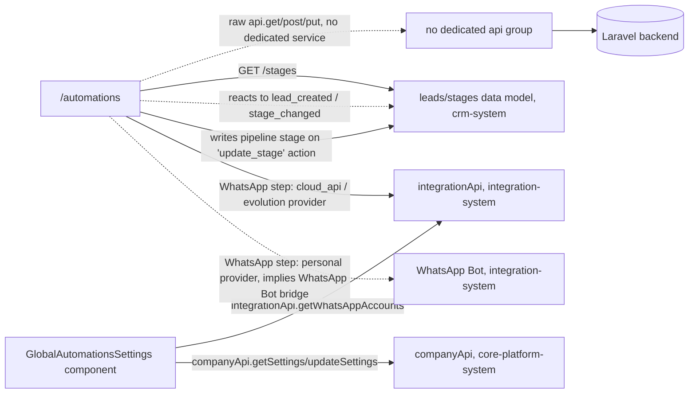

# Context Pack: Automation System

## Purpose
Lets a workspace define multi-step "drip sequences" (triggered by `lead_created`, `stage_changed`, or manual enrollment) whose steps send email, send WhatsApp, move a lead's pipeline stage, or wait a delay — plus a separate "Global Triggers" settings surface. Explicitly unrelated to the Meetings/scheduling system despite the similar "trigger" vocabulary. Small in surface area (one route) but cross-cutting in dependencies, which is why it's its own pack rather than folded into CRM or the WhatsApp systems.

## Features included
| Feature | Status | Plan key | Doc |
|---|---|---|---|
| Automations (Drip Sequences & Global Triggers) | active | `automations` | [../features/automations.md](../features/automations.md) |

## Pages included
- `/automations` — [../pages/automations.md](../pages/automations.md)

## APIs involved
- **No dedicated API service module** (`src/services/automations.ts` does not exist). The page calls the generic `api` client directly: `GET/POST /automations`, `PUT /automations/{id}`, `POST /automations/{id}/toggle`, `GET /email/templates`, `GET /stages`.
- Cross-system calls made directly from `GlobalAutomationsSettings` ([components/automations.md](../components/automations.md)): `integrationApi.getWhatsAppAccounts()` (cloud-template dropdown) and `companyApi.getSettings()`/`updateSettings()` (toggle state + message content) — both owned by other systems.

## State contexts involved
None owned here.

## External integrations
None directly — WhatsApp sends route through [integration-system.md](integration-system.md) (`cloud_api`/`evolution` providers) or [integration-system.md](integration-system.md)'s WhatsApp Bot (`personal` provider); email sends presumably route through the Email Marketing integration, though the exact backend wiring wasn't visible from this frontend read.

## Business flows
No dedicated flow doc exists yet for this feature specifically (it wasn't in scope for the original flow-generation pass). The lifecycle is: a lead event fires (`lead_created`/`stage_changed` from [crm-system.md](crm-system.md)) → a matching active sequence enrolls the lead → each step executes in order (email / WhatsApp via `cloud_api`, `evolution`, or `personal` provider / stage move / delay) → sequence completes or the lead exits early on a stage change that no longer matches. Consider adding `flows/automation-sequence-execution.md` if this pack is revisited with backend visibility.

## Dependencies on other systems
- **→ [crm-system.md](crm-system.md)**: reacts to `lead_created`/`stage_changed` events and writes pipeline stage changes back — the tightest coupling this system has.
- **→ [integration-system.md](integration-system.md)**: WhatsApp send steps for the `cloud_api`/`evolution` providers use `integrationApi`; the `personal` provider implies routing through WhatsApp Bot's Node bridge (not confirmed from the frontend alone — the step config only collects a template name/free-text message, the actual send mechanism is backend-side).
- **→ [core-platform-system.md](core-platform-system.md)**: `companyApi.getSettings/updateSettings` for the WhatsApp welcome-message toggle inside Global Triggers.

## Mermaid architecture diagram

## Known issues
1. **No dedicated service module** — every call is a raw `api.get/post/put` inline in the page component, unlike most other features in this app; a future refactor should extract `src/services/automations.ts` for consistency.
2. **The `personal` WhatsApp provider's actual send mechanism is unconfirmed from the frontend** — the step config UI only collects a template name (same as `cloud_api`), so whether it truly routes through the separate WhatsApp Bot bridge or something else server-side needs backend confirmation before relying on it.
3. No dedicated flow doc exists for the end-to-end sequence execution lifecycle (see Business flows above) — this pack's description of it is inferred from the page/component docs, not independently verified against a flow trace.

## Common implementation patterns
- **Provider-branching step config**: WhatsApp steps branch UI by provider (`personal`/`cloud_api` collect a template name; `evolution` collects free-text message) — follow this branch structure if adding a new send channel.
- **Tabs-in-one-page** structure (Drip Sequences / Global Triggers) rather than separate routes — if this feature grows, consider whether a new capability belongs as a third tab here or a new top-level page.

## Files to load before modifying this system
1. `src/app/(dashboard)/automations/page.tsx` — main page, sequence CRUD dialog, step builder.
2. `src/components/automations/GlobalAutomationsSettings.tsx` — Global Triggers tab, and its cross-system `integrationApi`/`companyApi` calls.
3. `src/lib/api.ts` (`companyApi`, `integrationApi.getWhatsAppAccounts` only — not the whole file).
4. [crm-system.md](crm-system.md) — for the lead/stage data model this feature reacts to and mutates.
5. This pack's linked feature/component docs above.

## Manual Notes
_None yet. Add notes here for anything this pack should account for that isn't derivable from the generated docs — this section is preserved verbatim across regenerations (see [../ai-rules.md](../ai-rules.md))._
