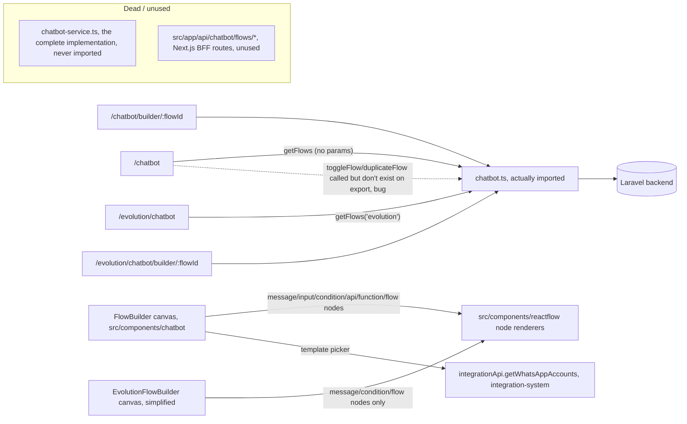

# Context Pack: Chatbot System

## Purpose
A drag-and-drop conversation-flow builder for WhatsApp automation, built on `@xyflow/react`. Two UI variants — `/chatbot` (WhatsApp Cloud API / Meta) and `/evolution/chatbot` (self-hosted Evolution bridge) — are the **same feature**, distinguished only by a `channel_type` field on the saved flow record, not two separate products. This is a distinct system from `/whatsapp-bot` (see [integration-system.md](integration-system.md)), which automates WhatsApp through an entirely different backend and data model despite the similar name.

## Features included
| Feature | Status | Plan key | Doc |
|---|---|---|---|
| Chatbot Flow Builder (WhatsApp Cloud API + Evolution) | partial | `chatbot` | [../features/chatbot.md](../features/chatbot.md) |

## Pages included
- `/chatbot` — flow list (Meta/default channel) — [../pages/chatbot.md](../pages/chatbot.md)
- `/chatbot/builder/[flowId]` — canvas editor — [../pages/chatbot-builder.md](../pages/chatbot-builder.md)
- `/evolution/chatbot` — flow list (Evolution channel) — [../pages/evolution-chatbot.md](../pages/evolution-chatbot.md)
- `/evolution/chatbot/builder/[flowId]` — simplified canvas editor — [../pages/evolution-chatbot-builder.md](../pages/evolution-chatbot-builder.md)

## APIs involved
- [api/chatbot.md](../api/chatbot.md) — `chatbotService` from `src/services/chatbot.ts`, the one actually imported everywhere. **Critical mismatch**: every page/component calls `getFlows(channelType)`, `toggleFlow(id)`, `duplicateFlow(id)`, `saveFlow(payload)` — none of which exist on the object `chatbot.ts` actually exports (`getFlows()` with no params, `getFlow`, `createFlow`, `updateFlow`, `deleteFlow` only). The complete implementation lives at `src/services/chatbot-service.ts` (exports `ChatbotFlow`, `saveFlow`, `toggleFlow`, `duplicateFlow`, `exportFlow`, `importFlow`) but is **never imported anywhere in `src/`**.
- `src/app/api/chatbot/flows/route.ts`, `.../[flowId]/route.ts` — Next.js BFF routes, proxy-shaped but **not called by any page** in this system; dead scaffold.
- Cross-system call: `integrationApi.getWhatsAppAccounts()` (owned by [integration-system.md](integration-system.md)) — loads real WhatsApp Business templates into the message-node property panel.

## State contexts involved
None owned here. Reads `useUser()` for `hasFeature('chatbot')` gating only.

## External integrations
- **Laravel backend** — flow persistence (nodes/edges JSON), proxied Meta/Evolution channel data.
- **WhatsApp Business templates** — pulled from [integration-system.md](integration-system.md)'s `integrationApi`, not owned here.
- No direct external call from this system beyond the Laravel proxy — actual message delivery/execution against WhatsApp is backend-only and not visible in this frontend (see the automation-execution flow below).

## Business flows
- [../flows/chatbot-flow-builder.md](../flows/chatbot-flow-builder.md) — authoring/editing/publishing a flow on the canvas.
- [../flows/chatbot-automation-execution.md](../flows/chatbot-automation-execution.md) — what is/isn't knowable from the frontend about runtime execution against incoming messages (mostly backend-only).

## Dependencies on other systems
- **→ [core-platform-system.md](core-platform-system.md)**: auth/plan gating (`hasFeature('chatbot')`).
- **→ [integration-system.md](integration-system.md)**: WhatsApp Business template data for message nodes; the Evolution Chatbot nav item is additionally hidden unless an active `evolution` integration exists (checked the same way integration-system's other Evolution-gated nav items are).
- No other system depends on this one.

## Mermaid architecture diagram

## Known issues
1. **Save/Toggle/Duplicate are likely broken at runtime.** Every page calls `chatbotService.toggleFlow()`, `.duplicateFlow()`, and (with a `channelType` arg) `.getFlows()` — methods that exist only on the unused sibling `chatbot-service.ts`, not on the actually-imported `chatbot.ts`. `next.config.ts` sets `typescript.ignoreBuildErrors: true`, which is presumably how this ships without failing the build. Verify against the live app before assuming these actions work; this is the single highest-priority thing to check before modifying this system.
2. `chatbot.ts` doesn't even export the `ChatbotFlow` type that components import — only a `Flow` type.
3. The Evolution builder is a **deliberately reduced** subset (message/condition/flow node types, plain free-text trigger keyword instead of the typed `TRIGGER_TYPES` selector) — don't treat differences between the two builders as bugs without checking `components/chatbot.md` first.
4. The Next.js `src/app/api/chatbot/flows/*` route handlers are unused dead code — don't build against them assuming they're the real backend contract.

## Common implementation patterns
- **Node types are registered per-builder** in a `nodeTypes` map passed to React Flow — `FlowBuilder` registers six (`message`, `input`, `condition`, `api`, `function`, `flow`), `EvolutionFlowBuilder` only three (`message`, `condition`, `flow`), with `condition` present in data but not creatable from its UI.
- **Trigger encoding**: `"{type}:{value}"` string (or bare `value` when type is `message`) is how `TRIGGER_TYPES` gets serialized into the saved flow — replicate this format if adding new trigger types.
- **`onConnect` blocks a second incoming edge** into any non-`message` node, keeping a state-machine-like single-parent structure while allowing unlimited edges into `message` nodes — preserve this invariant if extending the canvas.
- **`function` node bodies are stored as inert text** (`functionBody`) — nothing in the frontend executes this code; don't assume adding a UI for it means it runs anywhere client-side.

## Files to load before modifying this system
1. `src/components/chatbot/flow-builder.tsx` and `evolution-flow-builder.tsx` — the two canvases.
2. `src/services/chatbot.ts` **and** `src/services/chatbot-service.ts` — read both together to understand the method-mismatch bug before changing any save/toggle/duplicate logic.
3. `src/components/reactflow/*` — the shared node renderers both builders use.
4. `src/types/nodes.ts` — node/edge type shapes.
5. This pack's linked feature/api/flow docs above.

## Manual Notes
_None yet. Add notes here for anything this pack should account for that isn't derivable from the generated docs — this section is preserved verbatim across regenerations (see [../ai-rules.md](../ai-rules.md))._
