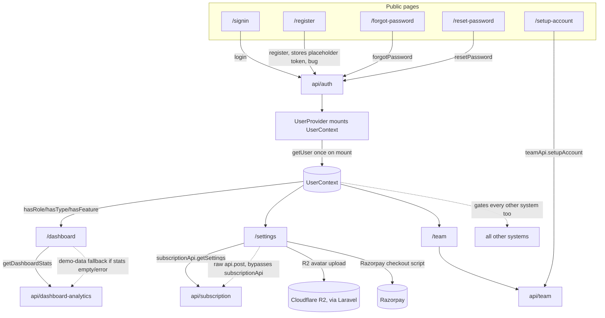

# Context Pack: Core Platform System

## Purpose
The account/session shell every authenticated (and pre-authenticated) surface in the app runs inside. Covers signing up, signing in, recovering a password, accepting a team invite, the universal post-login landing page, personal profile/notification/billing settings, and inviting/managing internal team members. Every other system in this app assumes a logged-in `UserContext` populated by this system.

## Features included
| Feature | Status | Plan key | Doc |
|---|---|---|---|
| Authentication & Onboarding | active | — (public, ungated) | [../features/authentication.md](../features/authentication.md) |
| Dashboard (Company Overview) | active | `dashboard` | [../features/dashboard.md](../features/dashboard.md) |
| Account Settings | active | `account_settings` | [../features/account_settings.md](../features/account_settings.md) |
| Team Management | partial | `team_management` | [../features/team_management.md](../features/team_management.md) |

## Pages included
- `/signin`, `/register`, `/forgot-password`, `/reset-password`, `/setup-account` — all public, outside `(dashboard)`, no sidebar/header.
- `/unauthorized` — protected, the `RoleGuard` redirect target.
- App shell layouts: `src/app/layout.tsx` (root — mounts `ErrorProvider`) and `src/app/(dashboard)/layout.tsx` (mounts `UserProvider`, `SubscriptionGuard`, `Sidebar`).
- `/dashboard` — universal landing page after login.
- `/settings` — profile/notifications/security/billing tabs.
- `/team` — member directory, invite/role/remove.

See [../pages/signin.md](../pages/signin.md), [register.md](../pages/register.md), [forgot-password.md](../pages/forgot-password.md), [reset-password.md](../pages/reset-password.md), [setup-account.md](../pages/setup-account.md), [unauthorized.md](../pages/unauthorized.md), [app-shell-layout.md](../pages/app-shell-layout.md), [dashboard.md](../pages/dashboard.md), [settings.md](../pages/settings.md), [team.md](../pages/team.md).

## APIs involved
- [api/auth.md](../api/auth.md) — `login`, `register` (⚠ see Known issues), `forgotPassword`, `resetPassword`, `logout`, `getUser`, `submitTesterRequest`, `loginWithGoogle` (unused).
- [api/team.md](../api/team.md) — `teamApi.getMembers/inviteMember/resendInvite/updateRole/removeMember/setupAccount`.
- [api/company.md](../api/company.md) — `companyApi.getSettings/updateSettings` (appears unused within this system; consumed instead by Automations, see [automation-system.md](automation-system.md)).
- [api/subscription.md](../api/subscription.md) — `subscriptionApi.getSettings` (used), `subscriptionApi.validateCoupon` (defined but unused — settings page duplicates the call inline via raw `api.post`).
- [api/dashboard-analytics.md](../api/dashboard-analytics.md) — `getDashboardStats()` only (not `getAnalyticsData`, which belongs to [crm-system.md](crm-system.md)).
- Raw/bypass calls (not through a named wrapper): `api.put('/users/:id')`, `api.post('/storage/r2/upload-image')`, `api.delete('/storage/r2/delete')`, `api.post('/subscription/validate-coupon'|'/create-order'|'/verify')` — all from `settings/page.tsx`.

## State contexts involved
- [state/user-context.md](../state/user-context.md) (`UserContext`) — **owned by this system**. `UserProvider` fetches `getUser()` once on mount (no refetch path — pages that mutate the user/company must `window.location.reload()`). Exposes `hasRole`/`hasType`/`hasPlan`/`hasFeature`, consumed by literally every other system for gating.
- [state/error-context.md](../state/error-context.md) (`ErrorContext`) — mounted in the root layout above this system, wraps the whole app including the public auth pages.
- `use-toast.ts` / `use-debounce.ts` / `use-media-query.ts` / `echo.ts`(dead)/`echo.js` — see [hooks/custom-hooks.md](../hooks/custom-hooks.md).

## External integrations
- **Laravel backend** (`API_BASE_URL`) — everything in this system.
- **Razorpay** — subscription checkout on the Billing tab of `/settings` (script loaded client-side, verified server-side via `/subscription/verify`).
- **Google OAuth via NextAuth** (`src/lib/auth.ts` `authOptions`) — configured but **not wired to any UI**; no "Sign in with Google" button exists on `/signin`. Dead/incomplete integration, do not assume it works.
- **Cloudflare R2** (via Laravel) — avatar upload on `/settings`.

## Business flows
- [../flows/authentication-and-onboarding.md](../flows/authentication-and-onboarding.md) — register/login/forgot-password/setup-account end to end.
- [../flows/impersonation.md](../flows/impersonation.md) — Super Admin "login as" mechanics (the `admin_token` pattern also reused by [admin-system.md](admin-system.md)'s agency impersonation).

## Dependencies on other systems
- **→ [crm-system.md](crm-system.md)**: the Dashboard's stat tiles/pipeline funnel are CRM data (`getDashboardStats` returns lead/meeting aggregates); Dashboard is documented here (as the universal landing surface) but its *content* is CRM-owned.
- No other system's code is required to load *this* one — it's the dependency root. Every other system depends on `UserContext`/`RoleGuard` from here.

## Mermaid architecture diagram

## Known issues
1. **`register()` stores a placeholder token** — `src/lib/api.ts` (`register`, ~line 152) calls `setSession('your_auth_token')`, a hard-coded literal, not the real API response token. Compare with `login()`, which correctly extracts `response.data.token || response.data.access_token`.
2. **`loginWithGoogle`/NextAuth Google provider exist but are unwired** — no sign-in UI calls them.
3. **`useToast` (legacy) still used on `/dashboard`** for the tester-request toast, contradicting the repo's `sonner`-only convention.
4. **Settings page bypasses `subscriptionApi`** for coupon/order/verify calls, hitting the raw `api` client directly instead — `subscriptionApi.validateCoupon` sits unused as a result.
5. **No `UserContext` refetch path** — any mutation to `user`/`company` (profile save, payment) requires a full `window.location.reload()`; there is no lighter invalidate/refresh function.
6. **Two near-duplicate `use-toast.ts` files** (`src/hooks` vs `src/components/ui`) with different `TOAST_LIMIT`/delay values, easy to import the wrong one.
7. **`echo.ts` is an empty stub** sitting alongside the real `echo.js` implementation — a bundler resolving `.ts` first would silently import nothing.

## Common implementation patterns
- **Access control**: wrap any new protected page in `<RoleGuard allowedFeatures={[...]}>` (add `allowedRoles`/`allowedTypes` only if the feature needs it beyond plan gating); gate any new sidebar item with the same `roles`/`types`/`feature` triple used elsewhere in `src/components/sidebar.tsx`.
- **Reading the current user**: always `useUser()` → `hasFeature()`/`hasRole()`/`hasType()`, never re-fetch `/api/user` yourself.
- **Rendering `user.company`**: never render the object directly (`{user.company}` crashes in prod) — always drill into a field (`user.company?.name`, `?.plan`, `?.status`).
- **Toasts**: use `sonner` (`toast.success()`/`toast.error()`), not the legacy `useToast` — even though this system's own Dashboard page violates this.
- **API calls**: add new endpoints to `src/lib/api.ts` as a named export/group; avoid the raw-`api`-client pattern that `/settings`'s billing calls fell into.

## Files to load before modifying this system
1. `src/contexts/UserContext.tsx` — the access-control source of truth.
2. `src/components/sidebar.tsx` — nav visibility rules, must stay in sync with any new route/feature key.
3. `src/lib/auth.ts` — session token helpers, NextAuth config.
4. `src/lib/api.ts` (auth/team/company/subscription sections only — it's a 2200+ line file, don't read it end to end).
5. `src/app/layout.tsx` and `src/app/(dashboard)/layout.tsx` — shell/provider wiring.
6. This pack's linked feature/page/api/state docs above, plus `context/ai-context.md` for the repo-wide three-dimensional access-control model.

## Manual Notes
_None yet. Add notes here for anything this pack should account for that isn't derivable from the generated docs — this section is preserved verbatim across regenerations (see [../ai-rules.md](../ai-rules.md))._
