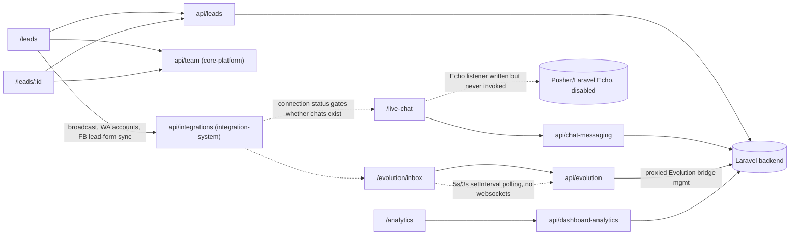

# Context Pack: CRM System

## Purpose
The day-to-day sales workspace: the lead list/kanban/detail views, the two WhatsApp-backed live chat inboxes tied to those leads, and the aggregated analytics dashboard that reports on both. This is the system most users spend the most time in.

## Features included
| Feature | Status | Plan key | Doc |
|---|---|---|---|
| Leads (CRM) | active | `leads` | [../features/leads.md](../features/leads.md) |
| Live Chat (WhatsApp Cloud API + Evolution Inbox) | partial | `live_chat` | [../features/live_chat.md](../features/live_chat.md) |
| Workspace Analytics | active | `analytics` | [../features/analytics.md](../features/analytics.md) |

## Pages included
- `/leads`, `/leads/[id]` — [../pages/leads.md](../pages/leads.md), [leads-detail.md](../pages/leads-detail.md)
- `/live-chat`, `/evolution/inbox` — [../pages/live-chat.md](../pages/live-chat.md), [evolution-inbox.md](../pages/evolution-inbox.md)
- `/analytics` — [../pages/analytics.md](../pages/analytics.md)

## APIs involved
- [api/leads.md](../api/leads.md) — `getLeads`, `getLead`, `createLead`, `updateLead`, `deleteLead`, `bulkDeleteLeads`, `bulkUpdateLeadStatus/Stage`, `updateLeadStage`, `getStages/createStage/updateStage/deleteStage/reorderStages/syncDefaultStages`, `updateLeadDetails` (duplicate of `updateLead`), `exportLeads`, `createPayment`.
- [api/chat-messaging.md](../api/chat-messaging.md) — `sendMessage`, `getMessages`, `initializeChat`, `getLeadsWithLatestMessages`, `getConversationMessages`, `authorize`, `me` (used only inside the disabled realtime listener).
- [api/evolution.md](../api/evolution.md) — `evolutionApi.*` (both the `/evolution/inbox` chat UI and the Evolution *connection setup*, the latter owned by [integration-system.md](integration-system.md)).
- [api/dashboard-analytics.md](../api/dashboard-analytics.md) — `getAnalyticsData()` (Analytics only; `getDashboardStats()` belongs to [core-platform-system.md](core-platform-system.md)'s Dashboard).
- Cross-feature calls made directly from the Leads page (not owned by this system): `teamApi.getMembers` ([core-platform-system.md](core-platform-system.md)), `integrationApi.sendBroadcast/getWhatsAppAccounts/getFacebookLeadForms/retrieveFacebookLeads` ([integration-system.md](integration-system.md)).

## State contexts involved
- None owned by this system. `UserContext` (gating) is consumed but owned by [core-platform-system.md](core-platform-system.md).
- **Important non-dependency**: `WhatsAppContext` is *not* consumed by `/live-chat` or `/evolution/inbox` despite the name overlap — it belongs to [integration-system.md](integration-system.md)'s WhatsApp Bot feature. See [state/whatsapp-context.md](../state/whatsapp-context.md).

## External integrations
- **Laravel backend** — all leads/chat/analytics data.
- **WhatsApp Business Cloud API (Meta)** and **Evolution (self-hosted bridge)** — the two channels `/live-chat` and `/evolution/inbox` read/write over, both proxied through Laravel. The actual *connection* to these lives in [integration-system.md](integration-system.md); this system only consumes an already-connected channel.
- **Pusher / Laravel Echo** — wired into `/live-chat` but its activation call is commented out (see Known issues).
- **Facebook Lead Ads** (via [integration-system.md](integration-system.md)) — a sync entry point embedded directly in the Leads toolbar.

## Business flows
- [../flows/lead-lifecycle.md](../flows/lead-lifecycle.md) — create → pipeline stage changes → deal close (`DealValueDialog` + `createPayment`) → import/export.
- [../flows/realtime-messaging.md](../flows/realtime-messaging.md) — the two inboxes' differing (and currently both imperfect) real-time mechanics.

## Dependencies on other systems
- **→ [core-platform-system.md](core-platform-system.md)**: auth/session, `teamApi.getMembers` for agent assignment on both Leads and its detail page.
- **→ [integration-system.md](integration-system.md)**: Live Chat requires a connected WhatsApp Cloud or Evolution integration to have any conversations at all; Leads' broadcast/Facebook-sync buttons call `integrationApi` directly.
- **← [automation-system.md](automation-system.md)**: Automations *reads* lead events (`lead_created`, `stage_changed`) and *writes* stage changes back — this system doesn't call automation code, but automation-system depends on this system's data model.
- **← [core-platform-system.md](core-platform-system.md)**: the Dashboard feature (owned there) displays this system's data (`getDashboardStats` aggregates leads/meetings).

## Mermaid architecture diagram

## Known issues
1. **`/live-chat` has no working real-time transport** — the Echo/Pusher listener (`setupRealtime()`) is fully written but its invocation is commented out; there's also no polling fallback, so new messages require a manual reload. `/evolution/inbox` instead polls every 5s (list) / 3s (active thread) — functional but not real-time.
2. **`src/components/leads/*`** (7 files) and **`src/components/chat/*`** are both confirmed **unused placeholder kits** — the real UI is colocated in the route folders (`src/app/(dashboard)/leads/*`). `components/chat`'s `ChatWindow` imports `wsService` from a fully-commented-out `websocket-service.ts` — would throw if ever mounted.
3. **`LeadsHeader.tsx` is dead code** — `/leads/page.tsx` actually renders `LeadsFilters`, not `LeadsHeader`.
4. **`updateLeadDetails`** in `api.ts` is a byte-for-byte duplicate of `updateLead`.
5. **Analytics period selector is inert** — `This Month`/`Last 6M`/`This Year`/`All Time` don't change the query; `getAnalyticsData()` takes no arguments.
6. **`WhatsAppContext` naming trap** — despite the name, it does not back either page in this system; see the state-contexts section above. Don't assume it does when debugging live chat.

## Common implementation patterns
- **Stage changes to `Deal Closed`/`Closed Won`** are intercepted client-side to open `DealValueDialog` instead of calling `updateLeadStage` directly — replicate this interception if adding new terminal stages that need a value/payment capture.
- **Debounced search** (`useDebounce`, 500ms) drives list fetches; a separate `isSearching` flag distinguishes "typing" from "loading" in the UI.
- **Mobile branching** via `useMediaQuery('(max-width: 768px)')` swaps table/kanban for a card list (`LeadsMobileView`) — follow this pattern rather than CSS-only responsive tables for data-dense views.
- **CSV import/export is client-side**: `parseCSVLine` + column mapping in-browser before calling `importLeads`; `exportLeads` builds a Blob download, no server file generation.

## Files to load before modifying this system
1. `src/app/(dashboard)/leads/page.tsx` and its colocated sibling components (`LeadsFilters`, `LeadsTable`, `KanbanBoard`, dialogs) — the real leads UI, not `src/components/leads/*`.
2. `src/app/(dashboard)/live-chat/page.tsx` and `src/app/(dashboard)/evolution/inbox/page.tsx` — note they do **not** share a chat component despite looking similar.
3. `src/lib/api.ts` (leads functions, chat-messaging functions, `evolutionApi` — not the whole file).
4. This pack's linked feature/page/api docs above, plus [../dependency-map.md](../dependency-map.md) §1b for the full page→API edge list.

## Manual Notes
_None yet. Add notes here for anything this pack should account for that isn't derivable from the generated docs — this section is preserved verbatim across regenerations (see [../ai-rules.md](../ai-rules.md))._
