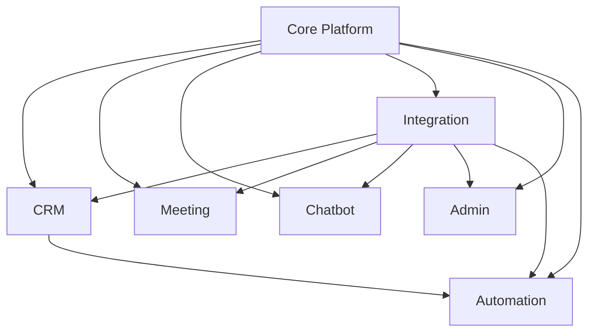

# Context Packs — LeadBajaar Frontend

A context pack is a "load this before you touch that system" bundle: one file per coherent subsystem, pulling together the feature/page/component/api/flow/state docs that already exist elsewhere in `ai-context/` plus a system-level architecture diagram, dependency list, and known-issue summary. Use these when a task's scope is a whole subsystem rather than a single feature — for single-feature work, go straight to the relevant `features/*.md` instead.

Generated entirely from the existing `ai-context/` documentation (`manifest.json`, `feature-map.md`, `dependency-map.md`, and every feature's frontmatter) — no source code was re-read to produce these packs. See [../ai-rules.md](../ai-rules.md) for the general documentation-maintenance rules and the "Maintaining context packs" section below for pack-specific ones.

## How the 20 features were grouped into 7 systems

Grouping used four signals together (dependency-graph edges, shared API groups, shared state contexts, and sidebar navigation groupings), not a single mechanical rule — a few calls are worth stating explicitly since they weren't obvious:

- **`live_chat` went to [crm-system.md](crm-system.md), not a WhatsApp-specific pack.** Even though its name says "WhatsApp Cloud API + Evolution Inbox," its conversations are keyed to Lead records and it shares no code with the Chatbot or WhatsApp Bot systems (`dependency-map.md` §3 confirms this explicitly — "no shared code"). A hypothetical unified "whatsapp-system" pack was considered and rejected: `chatbot` and `whatsapp_bot` don't share code with each other either (three independent implementations), so merging them would create a pack with no real internal cohesion beyond the word "WhatsApp" appearing in three feature names.
- **`whatsapp_bot` went to [integration-system.md](integration-system.md)**, following the actual sidebar nav grouping (`sidebar.tsx`'s "Integrations" section literally includes the "WhatsApp Bot" nav item) even though it's functionally an automation tool — this is called out explicitly inside that pack.
- **`analytics` went to [crm-system.md](crm-system.md)** rather than getting its own pack — it has no distinct external integration or business workflow beyond aggregating the same lead/deal data CRM already owns, and its API group (`dashboard-analytics`) is shared with the Dashboard feature.
- **`meetings` got its own pack** ([meeting-system.md](meeting-system.md)) despite being a single feature, because it has substantial independent surface area: its own API group, two public unauthenticated pages, a distinct external integration (Google Calendar, with a confirmed-dead alternate implementation), and dedicated flows.
- **`automations` got its own pack** ([automation-system.md](automation-system.md)) despite being a single route, because it's genuinely cross-cutting (touches leads, integrations, and WhatsApp Bot without belonging to any one of them) and has its own dedicated sidebar nav section.
- **`agency_management` went to [admin-system.md](admin-system.md)**, not [crm-system.md](crm-system.md) or a "growth" pack, despite sharing a sidebar section ("Clients & Growth") with Analytics — its actual coupling (impersonation mechanics, Super Admin governance overlap per `dependency-map.md` §3's `agency --> sysadmin` edge) is with platform administration, not sales pipeline data.

## The 7 systems

| System | Features | Depends on | Doc |
|---|---|---|---|
| Core Platform | authentication, dashboard, account_settings, team_management | — (dependency root) | [core-platform-system.md](core-platform-system.md) |
| CRM | leads, live_chat, analytics | core-platform, integration | [crm-system.md](crm-system.md) |
| Meeting | meetings | core-platform, integration | [meeting-system.md](meeting-system.md) |
| Chatbot | chatbot | core-platform, integration | [chatbot-system.md](chatbot-system.md) |
| Integration | integrations, lb_forms, whatsapp_bot, ads | core-platform | [integration-system.md](integration-system.md) |
| Automation | automations | crm, integration, core-platform | [automation-system.md](automation-system.md) |
| Admin | agency_management, system_admin, email_logs, error_logs, finance_module, developer_tools | core-platform, integration | [admin-system.md](admin-system.md) |

All 20 features are covered exactly once — cross-check against `manifest.json.stats.features` (20) if this ever drifts.

## System dependency graph

## Maintaining context packs incrementally

Follow [../ai-rules.md](../ai-rules.md)'s general rules, plus:

- **New feature added**: place it in the most-coupled existing system pack (check `dependency-map.md` §3 and the new feature's `relatedDocs.api`/frontmatter for the strongest signal) and update that pack's frontmatter `features` list, its tables, and this index's "The 7 systems" table. Only create a new pack file if the feature shares no API group, state context, or dependency edge with any existing pack — don't create a one-off pack just because a feature is new.
- **Feature removed/deprecated**: delete its rows from the owning pack's tables and its entry from `manifest.json`'s `contextPacks[].features`. If that was the pack's only feature, delete the pack file, its `contextPacks` entry, and this index's table row.
- **A feature moves systems** (rare — only if its actual dependencies shift, e.g. it starts sharing an API group with a different pack): move it, and update both packs' `dependencies` frontmatter if the cross-system edges changed too.
- **Manual Notes sections are sacrosanct**: every pack ends with a `## Manual Notes` section. Regenerating or editing a pack must never delete or overwrite existing text there — append, don't replace. This is the mechanism for preserving human/agent judgment calls that aren't re-derivable from the other `ai-context/` docs.
- After any of the above, re-render the system dependency graph above if an edge changed, and update `manifest.json`'s `contextPacks` array (see the top-level manifest, not a separate one here).
