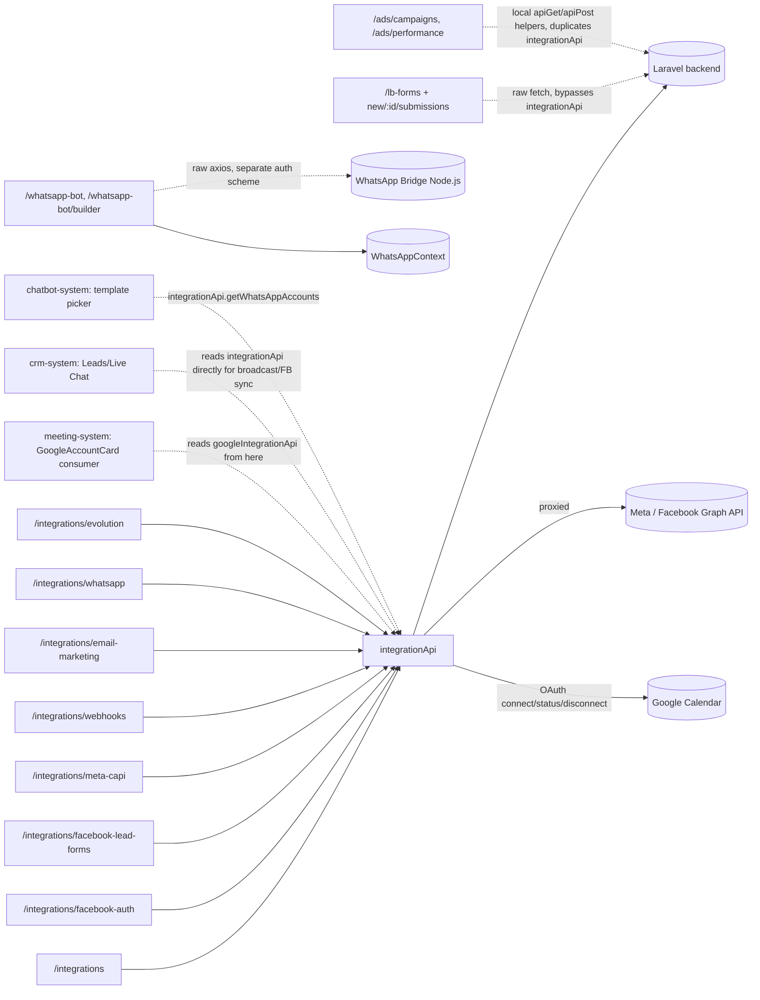

# Context Pack: Integration System

## Purpose
Everything about connecting the workspace to the outside world for lead capture and messaging: the central Integrations hub and its per-channel sub-pages, the native LB Forms builder, the independent WhatsApp Bot session/broadcast tool, and two standalone (currently orphaned) Meta Ads pages. Grouped together because all four are nav-grouped under the sidebar's "Integrations" section and/or share the same connection-catalog model (`integrations` table: `type`, `config`, `is_active`).

## Features included
| Feature | Status | Plan key | Doc |
|---|---|---|---|
| Integrations Hub | active | `integrations` | [../features/integrations.md](../features/integrations.md) |
| LB Forms | active | `integrations` | [../features/lb_forms.md](../features/lb_forms.md) |
| WhatsApp Bot (multi-session automation + broadcast) | active | `whatsapp_bot` | [../features/whatsapp_bot.md](../features/whatsapp_bot.md) |
| Meta Ads Management (Campaigns & Performance) | partial | — (orphan, no plan key) | [../features/ads.md](../features/ads.md) |

**Note on WhatsApp Bot's placement here**: functionally it's an automation tool, not a "connector," but it is nav-grouped inside the sidebar's "Integrations" section (`sidebar.tsx` line ~82) alongside the other items in this pack, and it's the third of three independent WhatsApp systems in this app (the other two — the Chatbot flow builder and Live Chat — are documented in [chatbot-system.md](chatbot-system.md) and [crm-system.md](crm-system.md) respectively, and share **no code** with this one).

## Pages included
- `/integrations` (hub), `/integrations/whatsapp`, `/integrations/evolution`, `/integrations/facebook-auth`, `/integrations/facebook-lead-forms`, `/integrations/meta-capi`, `/integrations/webhooks`, `/integrations/email-marketing` — see [../pages/integrations-hub.md](../pages/integrations-hub.md) and siblings.
- `/lb-forms`, `/lb-forms/new`, `/lb-forms/[id]`, `/lb-forms/[id]/submissions` — see [../pages/lb-forms.md](../pages/lb-forms.md) and siblings.
- `/whatsapp-bot`, `/whatsapp-bot/builder` — [../pages/whatsapp-bot.md](../pages/whatsapp-bot.md), [whatsapp-bot-builder.md](../pages/whatsapp-bot-builder.md).
- `/ads/campaigns`, `/ads/performance` — [../pages/ads-campaigns.md](../pages/ads-campaigns.md), [ads-performance.md](../pages/ads-performance.md) — **orphan routes**, not linked from any nav or in-app CTA.

## APIs involved
- [api/integrations.md](../api/integrations.md) — `integrationApi` (the largest single API surface in the app, `src/lib/api.ts` lines 457–1447: generic integrations CRUD, dozens of `getMeta*`/`createMeta*`/`updateMeta*`/`duplicateMeta*` functions, WhatsApp/Evolution account management, webhook CRUD, email config), plus `evolutionApi` and `googleIntegrationApi` (Google Calendar OAuth — cross-referenced by [meeting-system.md](meeting-system.md), owned here).
- No dedicated API group for **LB Forms** — all four pages call the Laravel backend with raw `fetch(`${API_BASE_URL}/lb-forms...`)`, manually attaching the bearer token, bypassing `src/lib/api.ts` entirely (see Known issues).
- No dedicated API group for **WhatsApp Bot** — talks to a **separate Node.js bridge** at `WHATSAPP_BASE_URL` (`https://wp.leadbajaar.com/api`) via raw `axios`, distinct from `API_BASE_URL`.
- No dedicated API group for **Ads** — both pages define local `apiGet`/`apiPost` helpers hitting `{API_BASE_URL}/meta/ads/*` directly, duplicating functions that already exist on `integrationApi` (`getMetaAdAccounts`, `getMetaCampaigns`, `getMetaAdAccountInsights`, `updateMetaStatus`, `updateMetaAdSet`).

## State contexts involved
- [state/whatsapp-context.md](../state/whatsapp-context.md) (`WhatsAppContext`) — **owned by this system's WhatsApp Bot feature**, not Live Chat (a corrected mismatch from the original per-cluster docs — see the note in the state doc itself). Provides session lists, ghost/historical sessions, chatbot flow rows for the selected session, all via raw `axios` to `WHATSAPP_BASE_URL` (bypasses `src/lib/api.ts`'s interceptor entirely).

## External integrations
- **Meta / Facebook Graph API** — proxied through Laravel; OAuth (Facebook Auth), Lead Forms, Conversions API (CAPI), Ads.
- **Google Workspace / Calendar OAuth** — `googleIntegrationApi`, proxied through Laravel (the working half of the calendar-sync story; see [meeting-system.md](meeting-system.md)).
- **WhatsApp Business Cloud API** — proxied through Laravel (`/integrations/whatsapp`).
- **Evolution** (self-hosted WhatsApp bridge, QR-code personal-number connect) — proxied through Laravel (`/integrations/evolution`).
- **WhatsApp Bridge (Node.js)**, `WHATSAPP_BASE_URL` — called **directly** from the frontend (not proxied), for WhatsApp Bot only.
- **Email providers** (AWS SES / SMTP / Mailgun) — configured via `/integrations/email-marketing`, proxied through Laravel.
- **Generic webhooks** — arbitrary external URLs configured by the tenant, both inbound (`/integrations/webhooks` receiver) and outbound (dispatcher with HMAC-SHA256 secret).

## Business flows
- [../flows/facebook-lead-ads-sync.md](../flows/facebook-lead-ads-sync.md)
- [../flows/meta-conversions-api-tracking.md](../flows/meta-conversions-api-tracking.md)
- [../flows/whatsapp-integration-setup.md](../flows/whatsapp-integration-setup.md) — covers both WhatsApp Cloud and Evolution connection setup.

## Dependencies on other systems
- **→ [core-platform-system.md](core-platform-system.md)**: auth/plan gating (`hasFeature('integrations')` / `hasFeature('whatsapp_bot')`).
- No dependency on [crm-system.md](crm-system.md), [chatbot-system.md](chatbot-system.md), or [meeting-system.md](meeting-system.md) — this system is upstream of them (they call *into* `integrationApi`/`googleIntegrationApi`, not the reverse). Treat this as connector infrastructure other systems consume.

## Mermaid architecture diagram

## Known issues
1. **LB Forms and Ads pages both bypass `src/lib/api.ts`** with ad-hoc `fetch`/local helpers, duplicating functionality already on `integrationApi` — a future refactor should introduce a proper `lbFormsApi` and reuse `integrationApi`'s Meta Ads functions instead of the parallel implementation in `/ads/*`.
2. **`/ads/campaigns` and `/ads/performance` are orphan routes** — no sidebar entry or in-app link reaches them; both redirect to `/integrations` via a "Go to Integrations" CTA when no ad account is found, implying an intended-but-never-wired entry point.
3. **`pixels-capi/` is an empty directory** (no page files) — a planned-but-unbuilt route stub; don't invent content for it.
4. **`src/app/api/integrations/` and `src/app/api/templates/`** (Next.js route handlers) are empty — all real calls go straight to Laravel, never through a Next.js API route.
5. **`AutomatedSyncDashboard` component is 100% mock data** — its real `api.get`/`api.post` calls are commented out in favor of hardcoded literals; not wired to anything real.
6. **`FacebookServicesManager` component is unused** anywhere in the app, and calls relative `/api/...` paths that would hit the wrong origin if ever mounted.
7. **Hub page has dead commented-out code** (`toggleIntegration`, `handleSaveConfig`, `handleSaveFacebookConfig`) and non-functional mock UI (`dummyLogs` integration-log accordion, non-wired "Data Sync Frequency"/"Data Mapping" selects).
8. **`WhatsAppBotPage`'s builder "Save Changes" doesn't persist canvas layout** — only shows a toast; node content itself saves immediately per-edit through separate calls.
9. **Two distinct auth schemes coexist**: `API_BASE_URL` (Bearer token via `src/lib/api.ts`'s interceptor) for everything Meta/Google/Evolution/LB-Forms, vs. `WHATSAPP_BASE_URL` (raw axios, `NEXT_PUBLIC_WHATSAPP_SECRET` bearer on privileged bridge calls) for WhatsApp Bot only — don't assume one client's auth conventions apply to the other.

## Common implementation patterns
- **Sidebar nav-item visibility for connectable integrations** is toggled by `integrationApi.getConnectedIntegrations()` on mount plus a custom `window` event `integrationsUpdated` (`sidebar.tsx`'s `canSee()`) — dispatch this event after any connect/disconnect action so the nav updates without a full reload.
- **Generic `IntegrationCard`/`UnifiedIntegrationDialog`** pattern is the hub's reusable connect/configure UI — prefer extending these over building a bespoke dialog for a new integration type, unless the connect flow genuinely needs a dedicated page (as WhatsApp/Evolution/Facebook Auth/Meta CAPI/Webhooks/Email Marketing all do).
- **WhatsApp Bot's "Sequence Tracing"** groups flat `trigger_keyword`/`required_state`/`next_state` rows into visual journeys client-side (`flowGroups` `useMemo`), rather than the backend returning a graph — replicate this walking logic if extending the visualization.
- **Anti-ban heuristics for broadcast** (`WhatsAppBotCampaigns`): regex-based warnings for link+media combos and lack of `{a|b}` spintax variation — client-side advisory only, not enforced server-side as far as this frontend shows.

## Files to load before modifying this system
1. `src/lib/api.ts` — read **only** the `integrationApi`, `evolutionApi`, and `googleIntegrationApi` sections (lines ~457–2186); it's a 2200+ line file, don't read it end to end.
2. `src/components/integrations/*`, `src/components/facebook-oauth/*`, `src/components/meta-capi/*` — the hub's shared dialogs and the Facebook OAuth/Meta CAPI dashboards.
3. `src/contexts/WhatsAppContext.tsx` — if touching WhatsApp Bot specifically.
4. `src/components/sidebar.tsx`'s `canSee()`/`integrationsUpdated` wiring — if adding a new connectable integration type.
5. This pack's linked feature/page/api docs above, plus the three flow docs for setup sequences.

## Manual Notes
_None yet. Add notes here for anything this pack should account for that isn't derivable from the generated docs — this section is preserved verbatim across regenerations (see [../ai-rules.md](../ai-rules.md))._
