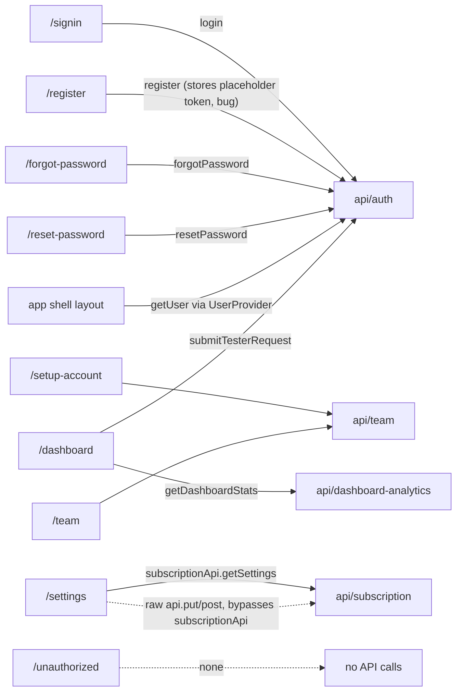
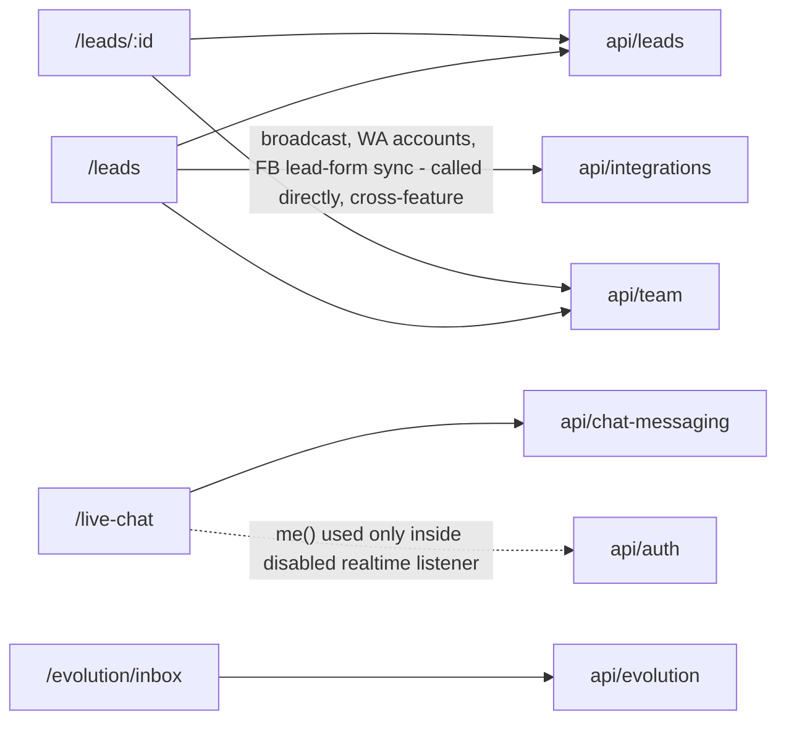
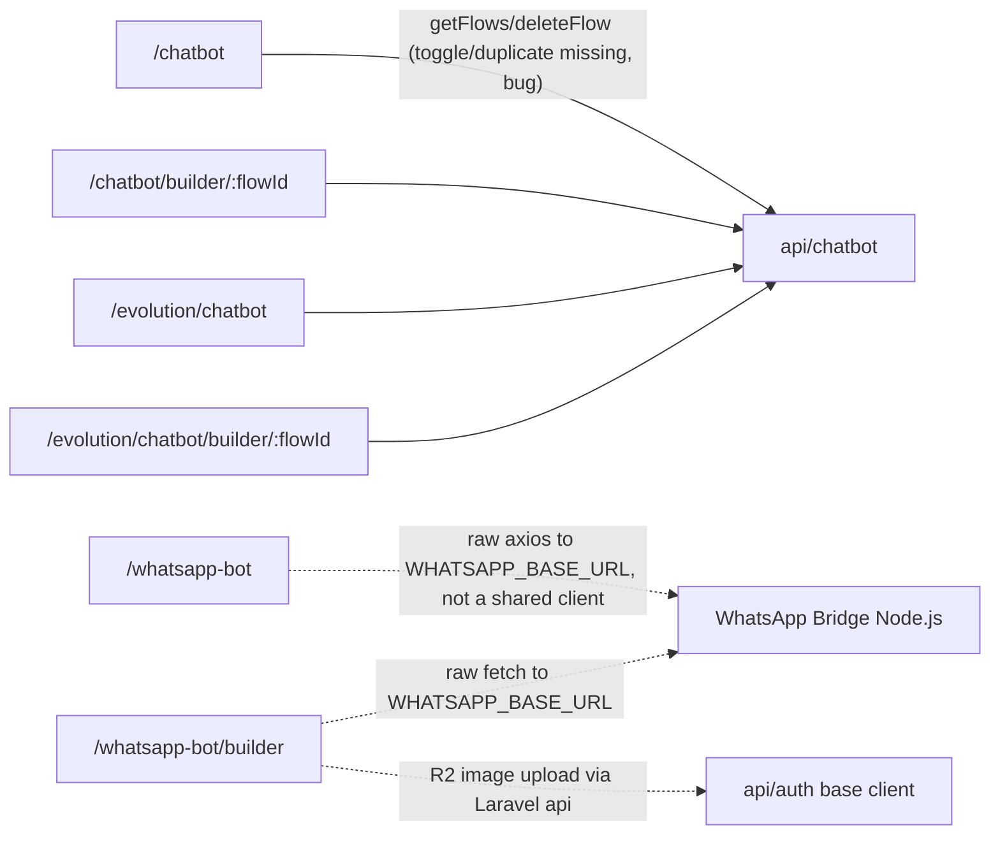
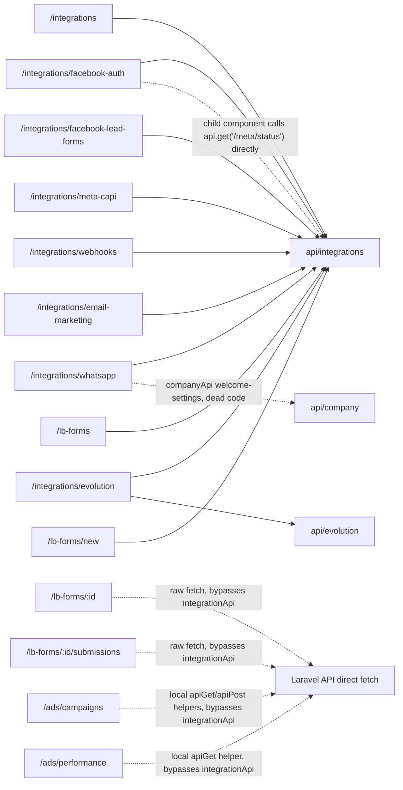
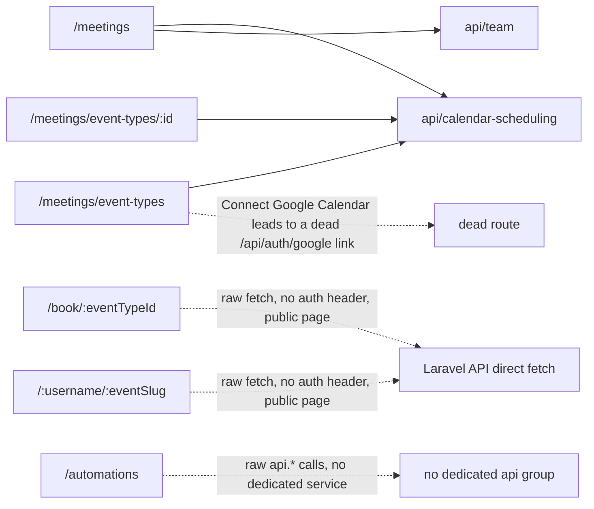
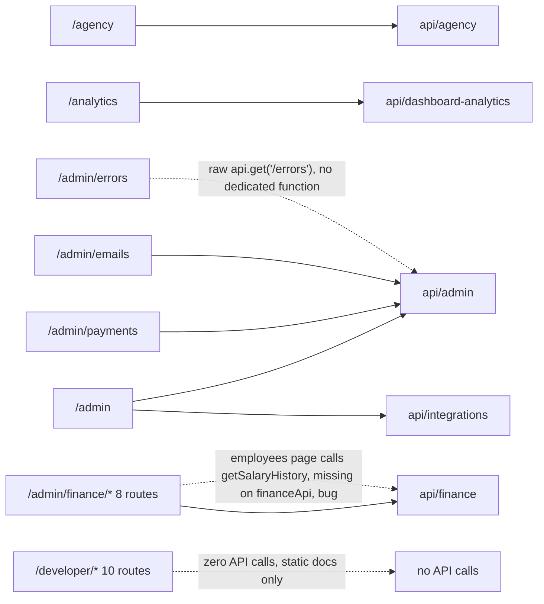
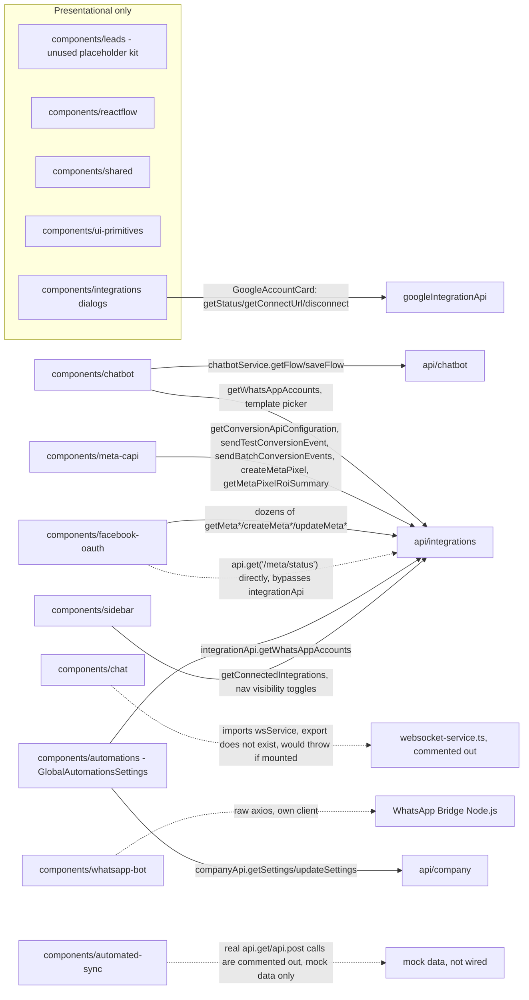
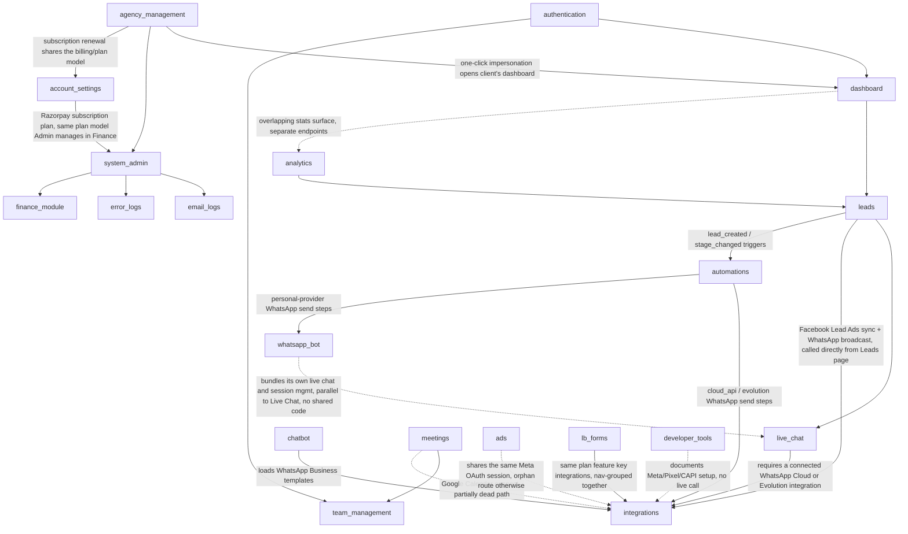
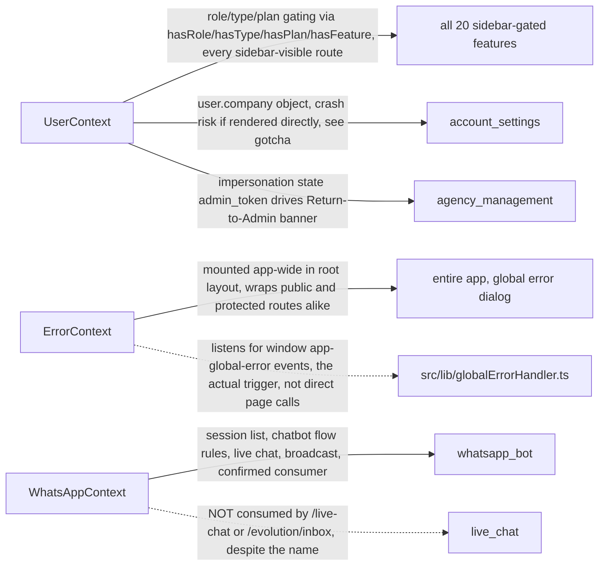
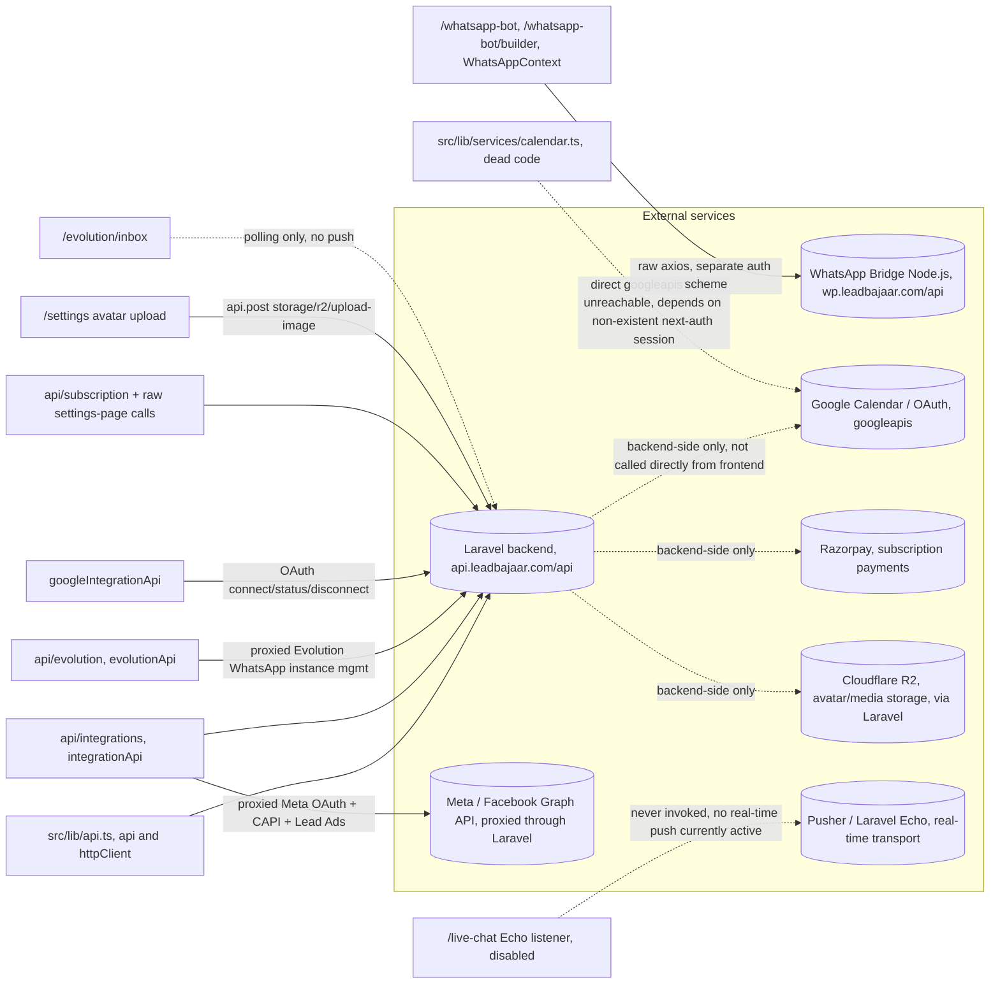

# Dependency Map — LeadBajaar Frontend

Cross-cutting dependency graphs derived from the docs in this folder (not a fresh code read): [pages/](pages/) "Data/API calls" sections, [components/](components/) service usage notes, [features/](features/) summaries, and [state/](state/) consumer notes. Where a source doc was ambiguous or made a guess, this file states the more confident cross-cluster finding and corrects the source doc (see the whatsapp-context correction below as an example of that process).

Companion docs: [feature-map.md](feature-map.md) (feature access/status), [manifest.json](manifest.json) (machine-readable index), [ai-rules.md](ai-rules.md) (maintenance rules — the same incremental-update rules apply here: touch only the sections affected by a code change, don't regenerate the whole file).

Edge style key used throughout: **solid** = normal call through the documented client (`src/lib/api.ts`, a dedicated service file). **dashed** = bypass/raw call (raw `fetch`/`axios`/`api.get` instead of the conventional wrapper) or a confirmed-broken/dead reference. Labels on dashed edges say why.

---

## 1. Page → API Dependencies

Grouped into the same six clusters used to generate this folder, since each cluster's pages call a coherent subset of API groups. Node labels use `:param` instead of `[param]` for dynamic segments (Mermaid reserves square brackets).

### 1a. Auth, Shell, Account, Team, Dashboard

### 1b. Leads & Live Chat

### 1c. Chatbot Builders & WhatsApp Bot

### 1d. Integrations, LB Forms, Ads

### 1e. Meetings, Scheduling, Automations

### 1f. Agency, Analytics, Admin, Finance, Developer

---

## 2. Component → Service Dependencies

Only components confirmed to make their own API/service calls are shown with solid/dashed edges to a target; purely presentational component groups (props-driven, no own data fetching) are grouped under "presentational only."

---

## 3. Feature → Feature Dependencies

Edges represent a real, evidenced coupling (shared data, a direct cross-feature API call, or a UI action that jumps into another feature) — not just "both under Platform Control" groupings. See [feature-map.md](feature-map.md) for the plain access-control table.

---

## 4. Context → Feature Dependencies

Note: the `live_chat` edge from `WhatsAppContext` is drawn dashed specifically to record a **non**-dependency — the original per-cluster doc guessed this context backed Live Chat; cross-checking against the Chatbot/WhatsApp Bot cluster's findings corrected it to `whatsapp_bot`. Kept here so the correction isn't lost on a future regeneration pass. See [state/whatsapp-context.md](state/whatsapp-context.md).

---

## 5. External Integrations

Every external system this frontend talks to, and which internal layer owns the call.

**Reading this diagram**: the frontend only ever talks to two hosts directly — the Laravel backend (`API_BASE_URL`) for almost everything, and the standalone WhatsApp Bridge (`WHATSAPP_BASE_URL`) for the `/whatsapp-bot` feature and `WhatsAppContext`. Meta, Google, Razorpay, and Cloudflare R2 are all reached **through** the Laravel backend (server-to-server) — the frontend never calls them directly, except for the confirmed-dead `src/lib/services/calendar.ts` path, which would call `googleapis` directly if it were ever reachable (it isn't — see [flows/google-calendar-sync.md](flows/google-calendar-sync.md)). Pusher/Laravel Echo is wired into the frontend (`src/services/websocket-service.ts`, `src/hooks/echo.js`) but its invocation on `/live-chat` is commented out, so no real-time channel is actually open anywhere in the app today.

---

## Maintaining this file incrementally

Follow [ai-rules.md](ai-rules.md)'s general rules, plus these specific to dependency graphs:

- **New page added**: add one edge in the relevant §1 cluster diagram (or a new cluster subsection if it doesn't fit an existing one).
- **New component added**: add one edge (or a "presentational only" membership) in §2.
- **New cross-feature call added** (a page/component in feature A calling an API group primarily owned by feature B): add/update the edge in §3 — that's the signal this graph exists to capture.
- **A context gains/loses a consumer**: update §4. If you find another mismatch between a state doc's `usedByFeatures` frontmatter and what a different cluster's docs actually show, fix the frontmatter at the source (`state/*.md`) the same way the `WhatsAppContext` correction was made here, don't just patch this file.
- **A new external host is introduced**: add it to §5's subgraph and note whether the frontend calls it directly or only the backend does — that distinction is the main thing an agent needs before writing code that assumes a direct integration.
- Re-render (mentally or via a Mermaid live editor) after editing — a diagram with a dangling or duplicate node ID fails silently in some renderers.
