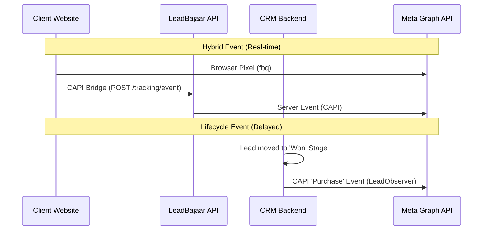

# Meta Conversions API (CAPI) — API Implementation Guide

This guide provides a technical breakdown of the Meta CAPI implementation within the LeadBajaar ecosystem. It covers the backend logic, service methods, and frontend component architecture.

---

## 1. Backend Architecture (`leadbajar-backend`)

### A. Core Service: `FacebookConversionApiService`
Located at `app/Services/FacebookConversionApiService.php`. This service is the engine for all Meta CAPI interactions.

#### `hashUserData(array $userData): array`
*   **Logic**: Complies with Meta's privacy requirements by hashing Personally Identifiable Information (PII) using **SHA-256**.
*   **Implementation**:
    *   Trims and lowercases emails.
    *   Removes non-numeric characters from phone numbers.
    *   Hashes: `email` (em), `phone` (ph), `first_name` (fn), `last_name` (ln), `city` (ct), `state` (st), `zip` (zp), and `country`.
    *   Automatically appends `client_ip_address` and `client_user_agent` from the request.

#### `sendConversionEvent(array $eventData, string $pixelId, string $accessToken): array`
*   **Logic**: Sends a single event to the Meta Graph API `/events` endpoint.
*   **Implementation**:
    *   Uses Laravel's `Http` client for POST requests.
    *   **Test Mode**: Checks `services.facebook.conversion_api.test_event_code` from config. If present, it appends `test_event_code` to the payload, allowing events to appear in the Meta Events Manager "Test Events" tab.

#### `createLeadEvent(array $leadData, array $userData): array`
*   **Logic**: Prepares the standard Meta `Lead` event payload.
*   **Implementation**: Sets `action_source` to 'website' and generates a unique `event_id` for deduplication.

---

### B. Lifecycle Automation: `LeadObserver`
Located at `app/Observers/LeadObserver.php`. Automatically bridges CRM actions to Meta CAPI.

#### `created(Lead $lead)`
*   **Logic**: Fired when a new lead is added to the CRM.
*   **Trigger**: If the lead has an associated `pixel_id` or a `fbcl_id` (Facebook Click ID), it automatically triggers the `sendToMeta` method with the `Lead` event name.

#### `updated(Lead $lead)`
*   **Logic**: Fired when lead data changes, specifically targeting **Stage Transitions**.
*   **Purchase Event**: Triggered when the stage changes to `won`, `converted`, or `closed`. It sends the `deal_value` and `currency` (default: INR).
*   **LeadQualified Event**: Triggered for mid-funnel stages like `qualified`, `hot`, `interested`, `demo`, or `proposal`.

#### `sendToMeta(Lead $lead, string $eventName, array $customData = [])`
*   **Logic**: Assembles the full CAPI payload for a specific lead.
*   **Implementation**:
    *   Fetches the `MetaIntegration` for the lead's owner to get the access token.
    *   Identifies the target Pixel (either explicitly from the lead or the user's default active pixel).
    *   Assembles `userData` (email, phone, name) and generates an `event_id` using the pattern `srv_{lead_id}_{timestamp}`.

---

### C. Public Ingestion: `TrackingController`
Located at `app/Http/Controllers/TrackingController.php`. Handles events coming from external websites.

#### `track(Request $request)`
*   **Endpoint**: `POST /api/tracking/event`
*   **Security**: Rate-limited to 120 requests/minute per IP.
*   **Logic**:
    1.  Validates the `pixel_id` and checks if it's active in the system.
    2.  Hashes user data immediately using the `capiService`.
    3.  Stores the event in the `meta_events` table for logging and ROI calculation.
    4.  Forwards the event to Meta CAPI using the owner's access token.

---

## 2. Frontend Implementation (`leadbajaar1.0`)

### A. Core Components

#### `PixelTestConsole.tsx`
*   **Purpose**: Debugging and verification UI for the Conversion API.
*   **Logic**: 
    *   Allows users to enter a `test_event_code` from Meta.
    *   Triggers manual test events (PageView, Lead, Purchase) to verify the server-to-server bridge.
    *   Displays real-time logs and diagnostics.

#### `CreatePixelModal.tsx`
*   **Purpose**: A 3-step wizard to create and configure a Meta Pixel.
*   **Logic**:
    1.  **Account Selection**: Fetches managed Ad Accounts via the Meta Graph API.
    2.  **Pixel Creation**: Calls the backend `MetaPixelController@create` to generate the pixel in Meta.
    3.  **Code Generation**: Provides the unified `lbTrack` script for the user to install on their website.

#### `RoiDashboard.tsx`
*   **Purpose**: Visualizes the effectiveness of CAPI-tracked conversions.
*   **Logic**:
    *   Calls `ConversionDashboardController@summary`.
    *   Aggregates data into:
        *   **Total Events**: Volume of CAPI signals processed.
        *   **Attributed Revenue**: Sum of `deal_value` for leads moved to "Won" stages.
        *   **Event Breakdown**: Chart showing the distribution of event types (Lead vs Purchase).

---

## 3. Data Flow Diagram

---

## 4. CRM Feedback Loop & Optimization
The frontend tracking is only the first step. Once a lead is captured, the **LeadBajaar CRM** maintains a persistent feedback loop with Meta to optimize ad delivery.

### 4.1 Conversion Leads Goal
By reporting stage changes (e.g., Lead → Qualified), the CRM trains Meta's AI to find users who are more likely to convert into actual sales. 

### 4.2 Required Form Data
When using custom forms (not Meta Lead Ads), ensure you capture and pass the following to `lbTrack`:
*   `email` and `phone`: Mandatory for matching.
*   `fbc` and `fbp`: Automatically captured if the LeadBajaar script is present.

### 4.3 Funnel Visualization
All events sent via `lbTrack` and the CRM are visualized in the **Meta Events Manager Funnel Builder**. Ensure your users configure their funnel order to enable advanced AI optimization.

---

## 5. Key Security & Privacy Measures
1.  **Automatic Hashing**: The `lbTrack` bridge and backend API automatically hash PII (Email/Phone) using SHA-256 before transmission.
2.  **Deduplication**: Both Browser (Pixel) and Server (CAPI) events share a unique `event_id` to prevent double-counting in Ads Manager.
3.  **Lead ID Retention**: For Meta Lead Ads, the unique `lead_id` is preserved throughout the CRM lifecycle to ensure 100% attribution accuracy.
4.  **Access Token Isolation**: Meta access tokens are scoped to individual users and never exposed to the frontend.
